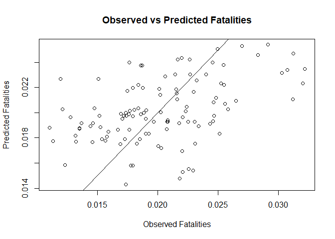

# Executive Summary

This project analyzes the "USSeatBelts.csv" dataset to evaluate factors influencing road safety, with a focus on seatbelt usage and its impact on road fatalities. Using R for data analysis and modeling, the study employs Generalized Linear Models (GLM) and correlation analysis to uncover key relationships. Findings indicate a significant correlation between seatbelt usage and reduced road fatalities, highlighting the effectiveness of safety measures. The study provides valuable insights for policymakers and road safety advocates, emphasizing the critical role of seat belt legislation in enhancing road safety.

# Introduction

**Background:** Road safety is a paramount concern globally, with significant implications for public health and policy. This study underscores the importance of statistical analysis in understanding and mitigating road fatalities.

**Problem Statement:** The primary inquiry of this case study is to determine the key factors influencing road fatalities, including the role of seat belt usage, and to predict their effects effectively.

## Data Overview:

**Data Source:** The 'USSeatBelts.csv' dataset, comprising various variables related to road safety.


```r
# data source https://vincentarelbundock.github.io/Rdatasets/datasets.html
# This code reads the 'USSeatBelts.csv' file into R as a dataframe named 'dataset'
dataset = read.csv("USSeatBelts.csv")

# Removes all rows with NA (missing) values.
dataset = na.omit(dataset)

#unction displays the first 5 rows of the dataset for a preliminary view.
head(dataset)
```

```
##    rownames state year miles fatalities seatbelt speed65 speed70 drinkage
## 8         8    AK 1990  3979 0.02462930     0.45      no      no      yes
## 9         9    AK 1991  4021 0.02511813     0.66      no      no      yes
## 10       10    AK 1992  3841 0.02811768     0.66     yes      no      yes
## 11       11    AK 1993  3918 0.03011741     0.69     yes      no      yes
## 12       12    AK 1994  4150 0.02048193     0.69     yes      no      yes
## 13       13    AK 1995  4123 0.02110114     0.69     yes      no      yes
##    alcohol income      age   enforce
## 8       no  21073 29.58628        no
## 9       no  21496 29.82771 secondary
## 10      no  22073 30.21070 secondary
## 11      no  22711 30.46439 secondary
## 12      no  23417 30.75657 secondary
## 13      no  23971 31.17860 secondary
```

**Data Preparation:** The data preparation involved cleaning, handling missing values, and structuring the data for analysis.


```r
# Function provides a detailed summary of the dataset, including data types, missing values, and basic statistics
skimr::skim(dataset)
```


Table: Data summary

|                         |        |
|:------------------------|:-------|
|Name                     |dataset |
|Number of rows           |556     |
|Number of columns        |13      |
|_______________________  |        |
|Column type frequency:   |        |
|character                |6       |
|numeric                  |7       |
|________________________ |        |
|Group variables          |None    |


**Variable type: character**

|skim_variable | n_missing| complete_rate| min| max| empty| n_unique| whitespace|
|:-------------|---------:|-------------:|---:|---:|-----:|--------:|----------:|
|state         |         0|             1|   2|   2|     0|       51|          0|
|speed65       |         0|             1|   2|   3|     0|        2|          0|
|speed70       |         0|             1|   2|   3|     0|        2|          0|
|drinkage      |         0|             1|   2|   3|     0|        2|          0|
|alcohol       |         0|             1|   2|   3|     0|        2|          0|
|enforce       |         0|             1|   2|   9|     0|        3|          0|


**Variable type: numeric**

|skim_variable | n_missing| complete_rate|     mean|       sd|      p0|      p25|      p50|      p75|      p100|hist  |
|:-------------|---------:|-------------:|--------:|--------:|-------:|--------:|--------:|--------:|---------:|:-----|
|rownames      |         0|             1|   378.53|   213.14|    8.00|   201.75|   373.50|   548.25|    765.00|▆▇▇▇▆ |
|year          |         0|             1|  1991.74|     3.63| 1983.00|  1989.00|  1992.00|  1995.00|   1997.00|▂▅▇▇▇ |
|miles         |         0|             1| 46134.23| 46554.86| 3316.00| 13004.50| 35143.00| 59968.00| 285612.00|▇▂▁▁▁ |
|fatalities    |         0|             1|     0.02|     0.01|    0.01|     0.02|     0.02|     0.02|      0.04|▂▇▇▂▁ |
|seatbelt      |         0|             1|     0.53|     0.17|    0.06|     0.42|     0.55|     0.65|      0.87|▁▃▆▇▂ |
|income        |         0|             1| 19572.16|  4423.43| 9696.00| 16475.75| 19202.00| 22320.75|  35863.00|▂▇▆▁▁ |
|age           |         0|             1|    35.47|     1.44|   29.59|    34.73|    35.59|    36.27|     39.17|▁▁▆▇▂ |

## Methodology:

**Statistical Techniques Used:** The study employed methods like GLM and correlation analysis to evaluate the data. The choice of these methods was based on their suitability for analyzing relationships within the dataset.

**Implementation in R:** The analysis was carried out in R, with a focus on leveraging its statistical capabilities for accurate data interpretation. Code snippets illustrate the application of these methods.


```r
# creates a new dataframe 'num' with numeric columns from 'dataset
num=data.frame(dataset$year, dataset$miles, dataset$fatalities, dataset$seatbelt, dataset$income, dataset$age)
# calculates the correlation matrix of 'num' and stores it in 'ncor'
ncor=cor(num)
#  visualizes this correlation matrix.
library(corrplot)
```

```
## corrplot 0.92 loaded
```

```r
corrplot(ncor)
```

<!-- -->

```r
ncor
```

```
##                    dataset.year dataset.miles dataset.fatalities
## dataset.year         1.00000000    0.02296322         -0.4752451
## dataset.miles        0.02296322    1.00000000         -0.1113372
## dataset.fatalities  -0.47524506   -0.11133720          1.0000000
## dataset.seatbelt     0.67923708    0.20653078         -0.4027138
## dataset.income       0.69657763    0.15811522         -0.6928618
## dataset.age          0.27978679    0.01618082         -0.2730244
##                    dataset.seatbelt dataset.income dataset.age
## dataset.year              0.6792371      0.6965776  0.27978679
## dataset.miles             0.2065308      0.1581152  0.01618082
## dataset.fatalities       -0.4027138     -0.6928618 -0.27302440
## dataset.seatbelt          1.0000000      0.6223398  0.15895198
## dataset.income            0.6223398      1.0000000  0.36223372
## dataset.age               0.1589520      0.3622337  1.00000000
```


```r
# prepares data for the GLM analysis by selecting relevant variables and creating a new dataframe 'df'
x1 = dataset$seatbelt
x2 = as.factor(dataset$speed70)
x3 = dataset$alcohol
y =  dataset$fatalities
df = data.frame(x1, x2, x3, y)
```


### Model trained using 80% of this dataset and suggest an appropriate GLM to model ouput to input variables.


```r
# Sets a seed for reproducibility.
# Splits the data into training (80%) and testing (20%) sets.
set.seed(123)
n=nrow(df)
indexes = sample(n,n*(80/100))
trainset = df[indexes,]
testset = df[-indexes,]
dim(testset)
```

```
## [1] 112   4
```

```r
dim(trainset)
```

```
## [1] 444   4
```

Specified the significant variables on the output variable at the level of 𝛼=0.05 and explored the related hypotheses test, estimating the parameters of your model.


```r
#Fits a GLM on the training set and displays the summary of the model.
dataglm = glm(y~.,trainset,family = "gaussian")
summary(dataglm)
```

```
## 
## Call:
## glm(formula = y ~ ., family = "gaussian", data = trainset)
## 
## Coefficients:
##               Estimate Std. Error t value Pr(>|t|)    
## (Intercept)  0.0260988  0.0007622  34.242  < 2e-16 ***
## x1          -0.0117400  0.0013896  -8.449 4.35e-16 ***
## x2yes        0.0014684  0.0007395   1.986  0.04770 *  
## x3yes       -0.0020702  0.0006527  -3.172  0.00162 ** 
## ---
## Signif. codes:  0 '***' 0.001 '**' 0.01 '*' 0.05 '.' 0.1 ' ' 1
## 
## (Dispersion parameter for gaussian family taken to be 2.164909e-05)
## 
##     Null deviance: 0.0115069  on 443  degrees of freedom
## Residual deviance: 0.0095256  on 440  degrees of freedom
## AIC: -3502.8
## 
## Number of Fisher Scoring iterations: 2
```

## Predict the output of the test dataset using the trained model. Provide the functional form of the optimal predictive model.

$$yhati=0.026+-0.011x_{1i}+0.001x_{2i}+-0.002x_{3i}$$


```r
#Predicts fatalities using the fitted GLM on the test set.
#Compares predictions ('pred') with actual values ('actual') and shows the first few predictions.

pred=predict(dataglm,testset)
actual=testset$y
values= data.frame(pred,actual)
head(values)
```

```
##          pred     actual
## 1  0.02081575 0.02462930
## 2  0.01835034 0.02511813
## 9  0.02457256 0.02827584
## 15 0.02093315 0.02647177
## 17 0.01928954 0.02252961
## 18 0.01964174 0.02205463
```

## d) Provide the confusion matrix and obtain the probability of correctness of predictions.


```r
#Calculates the Root Mean Square Error (RMSE) to evaluate the model's predictive accuracy.
RMSE=sqrt(sum(pred-actual)^2/length(actual))
RMSE
```

```
## [1] 0.0007943193
```

### Plotting Observed vs. Predicted Values


```r
# Predict values using the GLM model
predictions = predict(dataglm, type = "response")

# Plotting observed vs. predicted values
plot(actual, pred, xlab = "Observed Fatalities", ylab = "Predicted Fatalities", main = "Observed vs Predicted Fatalities")
abline(0, 1)
```

<!-- -->

### Residuals Plot:


```r
# Calculating residuals
residuals = actual - pred

# Plotting residuals
plot(pred, residuals, xlab = "Predicted Fatalities", ylab = "Residuals", main = "Residuals vs Predicted Fatalities")

abline(h = 0)
```

<!-- -->

### Diagnostic Plots:


```r
par(mfrow = c(2, 2))
plot(dataglm)
```

<!-- -->
